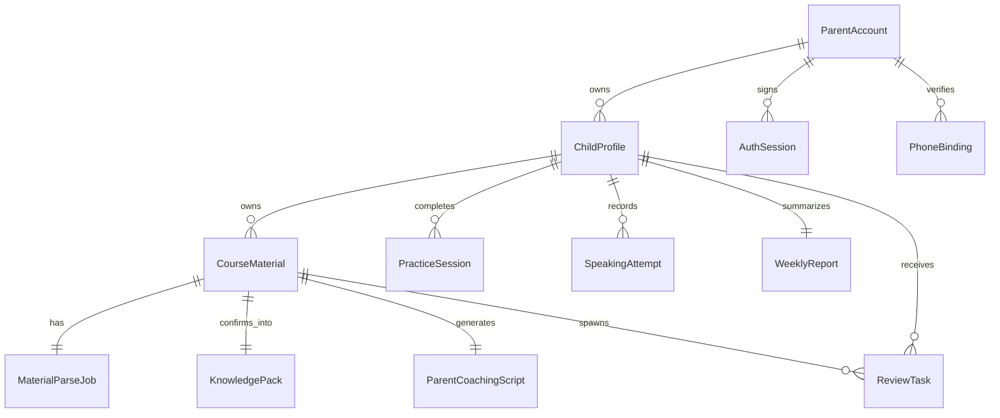

# 数据模型与契约

## 当前核心实体

### `ParentAccount`

- `id`
- `display_name`
- `avatar_url`
- `phone_number`
- `phone_verified_at`
- `wechat_union_id`
- `wechat_open_id`

### `AuthSession`

- `id`
- `parent_account_id`
- `refresh_token_hash`
- `revoked`
- `access_expires_at`
- `refresh_expires_at`

### `PhoneBinding`

- `id`
- `parent_account_id`
- `phone_number`
- `otp_code`
- `expires_at`
- `verified_at`

### `ChildProfile`

- `id`
- `parent_account_id`
- `name`
- `age`
- `level`
- `learning_goal`
- `preferred_review_duration_minutes`
- `parent_notes`

### `CourseMaterial`

- `id`
- `child_id`
- `teacher_name`
- `lesson_date`
- `title`
- `topic`
- `status`
- `source_images`
- `source_image_keys`
- `normalized_image_keys`
- `file_size_bytes`
- `uploaded_at`
- `ocr_text`
- `tags`
- `image_records`
- `learning_assets`

### `MaterialImageRecord`

- `id`
- `page_index`
- `source_type`
- `original_filename`
- `url`
- `object_key`
- `content_type`
- `size_bytes`
- `image_title`
- `ocr_text`
- `vocabulary`
- `sentences`
- `details`

### `MaterialParseJob`

- `id`
- `material_id`
- `status`
- `confidence_summary`
- `warnings`
- `started_at`
- `finished_at`
- `draft_title`
- `draft_topic`
- `draft_vocabulary`
- `draft_sentences`
- `draft_image_records`
- `draft_learning_assets`

### `LearningAsset`

- `id`
- `text`
- `kind`
- `translation`
- `source_page_index`
- `source_bbox`
- `source_visual_description`
- `pronunciation_text`
- `image_prompt`
- `difficulty`
- `teaching_note`
- `is_core`
- `generated_image_status`
- `generated_image_url`
- `tts_us_status`
- `tts_us_url`
- `tts_uk_status`
- `tts_uk_url`
- `primary_accent`

### `KnowledgePack`

- `id`
- `material_id`
- `topic`
- `difficulty_band`
- `lesson_summary`
- `review_recommendation`
- `vocabulary_items`
- `sentence_patterns`

### `ReviewTask`

- `id`
- `child_id`
- `material_id`
- `task_type`
- `difficulty`
- `content_json`
- `due_date`
- `status`

### `PracticeSession`

- `id`
- `child_id`
- `review_task_ids`
- `started_at`
- `completed_at`
- `score`
- `weak_points`

### `SpeakingAttempt`

- `id`
- `child_id`
- `material_id`
- `prompt_text`
- `audio_url`
- `transcript`
- `pronunciation_score`
- `feedback`
- `status`

### `ParentCoachingScript`

- `id`
- `material_id`
- `title`
- `intro`
- `steps`

### `WeeklyReport`

- `id`
- `child_id`
- `week_start`
- `week_end`
- `completed_sessions`
- `reviewed_words`
- `speaking_attempts`
- `weak_items`
- `recommended_actions`

## 当前关系图

## 状态枚举

### `MaterialStatus`

- `uploaded`
- `processing`
- `needs_review`
- `ready`
- `failed`
- `archived`

### `JobStatus`

- `queued`
- `processing`
- `needs_review`
- `ready`
- `failed`

### `ReviewTaskStatus`

- `pending`
- `in_progress`
- `completed`

### `MediaGenerationStatus`

- `pending`
- `processing`
- `ready`
- `failed`

## 当前建模特点

- `image_records`、`learning_assets`、`vocabulary_items`、`sentence_patterns` 和 `content_json` 都是 JSON 字段，当前优先服务 MVP 迭代速度。
- `CourseMaterial` 同时保留原始图片信息和 AI 结构化结果，方便 AI 校对页和课程详情页展示来源。
- `LearningAsset` 已包含后续题库、配图、TTS、语音评分需要的来源位置信息和媒体状态。

## 下一阶段可能演进

- 当题库、语音和报告能力继续扩展时，`LearningAsset`、`ReviewTask`、`SpeakingAttempt` 很可能从 JSON-heavy 模型进一步拆分。
- 如果要支持更强的审计、搜索和统计，图片页记录与媒体生成记录也可能从 `CourseMaterial` JSON 切出独立表。
