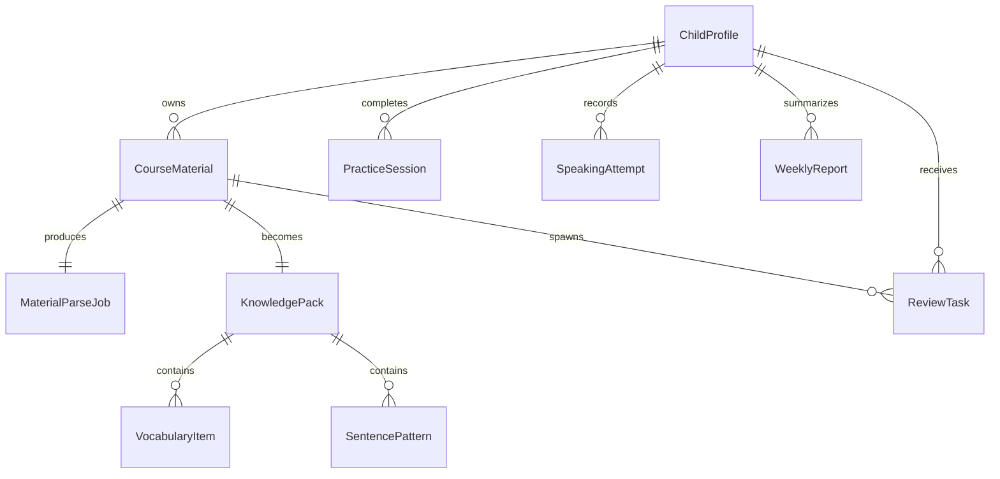

# Data Models And Contracts

## Core Entities

### ChildProfile
- `id`
- `name`
- `avatar_url`
- `age`
- `level`
- `learning_goal`
- `preferred_review_duration_minutes`
- `parent_notes`

### CourseMaterial
- `id`
- `child_id`
- `teacher_name`
- `lesson_date`
- `title`
- `topic`
- `status`
- `source_images`
- `pdf_url`
- `ocr_text`
- `tags`

### MaterialParseJob
- `id`
- `material_id`
- `status`
- `confidence_summary`
- `warnings`
- `started_at`
- `finished_at`

### KnowledgePack
- `id`
- `material_id`
- `topic`
- `difficulty_band`
- `lesson_summary`
- `review_recommendation`

### VocabularyItem
- `id`
- `knowledge_pack_id`
- `word`
- `phonics`
- `meaning_cn`
- `image_url`
- `audio_url`
- `example_sentence`

### SentencePattern
- `id`
- `knowledge_pack_id`
- `sentence`
- `meaning_cn`
- `usage_type`
- `audio_url`

### ReviewTask
- `id`
- `child_id`
- `material_id`
- `task_type`
- `difficulty`
- `content_json`
- `due_date`
- `status`

### PracticeSession
- `id`
- `child_id`
- `review_task_ids`
- `started_at`
- `completed_at`
- `score`
- `weak_points`

### SpeakingAttempt
- `id`
- `child_id`
- `material_id`
- `prompt_text`
- `audio_url`
- `transcript`
- `pronunciation_score`
- `feedback`
- `status`

### WeeklyReport
- `id`
- `child_id`
- `week_start`
- `week_end`
- `completed_sessions`
- `reviewed_words`
- `speaking_attempts`
- `weak_items`
- `recommended_actions`

## Relationship Summary

## Contract Guidance
- Use stable IDs across mobile and backend.
- Prefer explicit enums for `status`, `task_type`, and `difficulty_band`.
- Keep `content_json` flexible for different task types, but make the envelope predictable:
  - `prompt`
  - `choices`
  - `correct_answer`
  - `assets`
  - `hints`
- Return both source data and generated knowledge in lesson detail APIs so the app can show provenance.
