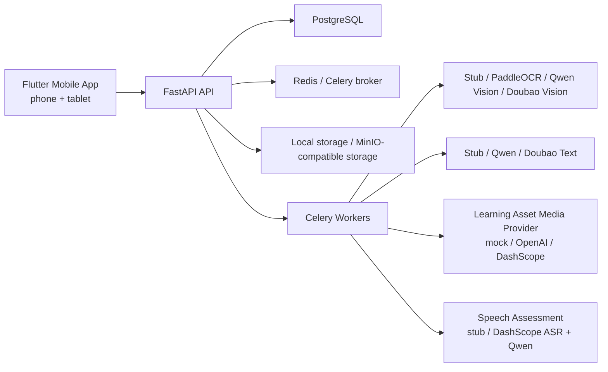
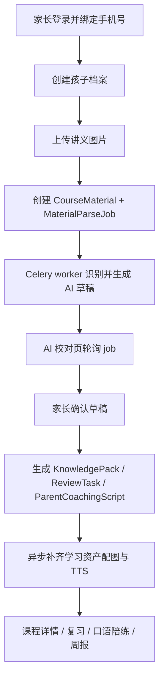

# LearningEnglish 系统总览

## 当前定位

LearningEnglish 当前是一个“家长上传讲义 -> AI 识别 -> 家长校对 -> 课程详情 -> 复习/陪练 -> 周报”的本地可运行 MVP。项目已经不再是纯脚手架，而是具备可验证主链、真机安装链路、Harness 证据约定和一批端到端测试的工作仓库。

## 当前系统形态

## 当前主链

## 代码边界

- `apps/mobile`：Flutter 客户端，负责登录、资料库、上传、AI 校对、课程详情、复习、报告和个人页。
- `apps/admin`：React/Vite 多租户后台原型，当前可接本地 admin API 做 dashboard/access 查看和少量受控 mutation。
- `services/api`：FastAPI API，负责鉴权、同步读写、领域编排和稳定契约。
- `services/workers`：Celery worker，负责讲义识别、学习资产媒体生成、周报聚合等异步任务。
- `packages/contracts`：Dart 侧共享契约，和 API `Pydantic` model 对齐。
- `packages/design_tokens`：Flutter UI token。
- `scripts/harness`：MVP readiness、主链 smoke、Doubao smoke、iOS 模拟器辅助脚本。

## 当前不是的东西

- 还不是生产级多环境系统：目前以本地 `Docker Compose` + 本地/局域网验证为主。
- 已具备录音上传 + 异步真实评分闭环：`speaking_attempts` 已有 multipart 上传、worker 评分、DashScope ASR + Qwen 评分、结果页和周报回填；`dist/harness/HN-017/` 已保留真机提交、worker 回写和结果页截图 evidence。
- HN-016 / HN-016A 后，本地示例和 Docker Compose 默认使用 DashScope 媒体 provider：`MEDIA_PROVIDER=real`、`MEDIA_IMAGE_PROVIDER=dashscope`、`MEDIA_TTS_PROVIDER=dashscope`；自动化测试才显式使用 mock provider。
- worksheet OCR / parsing 默认也不再是 stub：本地示例和 Docker Compose 默认使用 `AI_PROVIDER=qwen`，由 DashScope Qwen-VL + Qwen 文本模型完成识别与结构化抽取；Doubao 保留为可切换真实 provider。
- 还没有完整 Android 可交付链路：iOS 内测链路已跑通，Android 仍受本机 SDK 环境阻塞。
