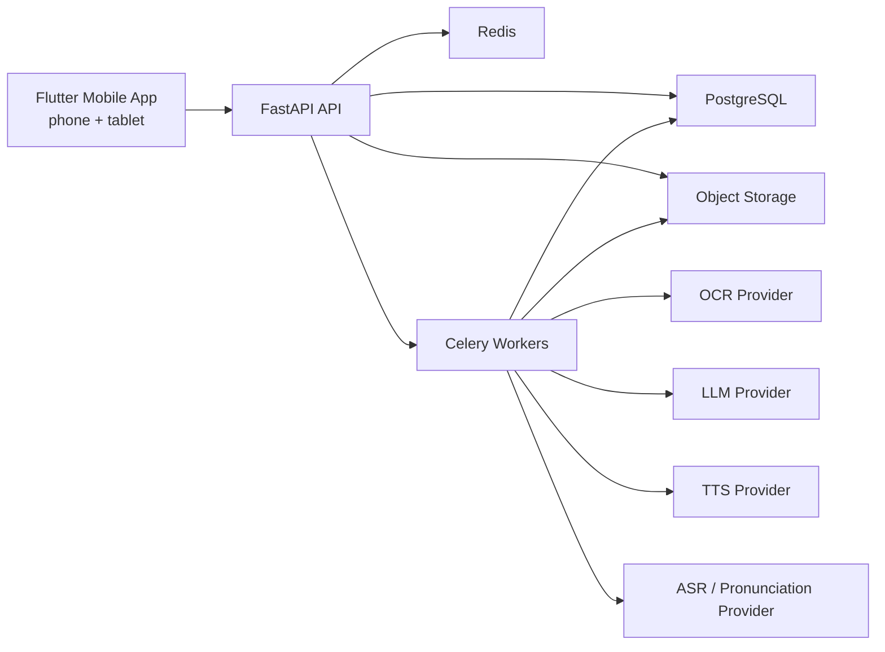
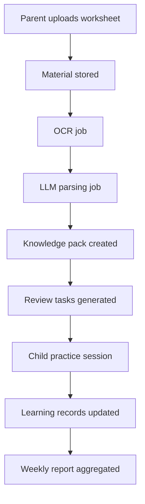

# LearningEnglish System Overview

## Summary
LearningEnglish uses a documentation-first, mobile-first architecture. The mobile client is a Flutter app that serves parents and children across phone and tablet layouts. The backend is a FastAPI modular monolith with asynchronous workers for OCR, AI parsing, speech, and report aggregation.

## High-Level Architecture

## Core Product Flow

## System Boundaries
- Mobile app owns presentation, local cache, session state, and adaptive layouts.
- API owns synchronous reads/writes, auth, orchestration, and stable contracts.
- Workers own long-running OCR, generation, and speech tasks.
- External AI providers are accessed only through abstraction layers.

## Repository Layout
- `apps/mobile`: future Flutter application
- `packages/contracts`: shared domain/API contracts
- `packages/design_tokens`: UI tokens derived from the design system
- `services/api`: FastAPI service
- `services/workers`: Celery worker service
- `infra`: deployment, local environments, and ops files
