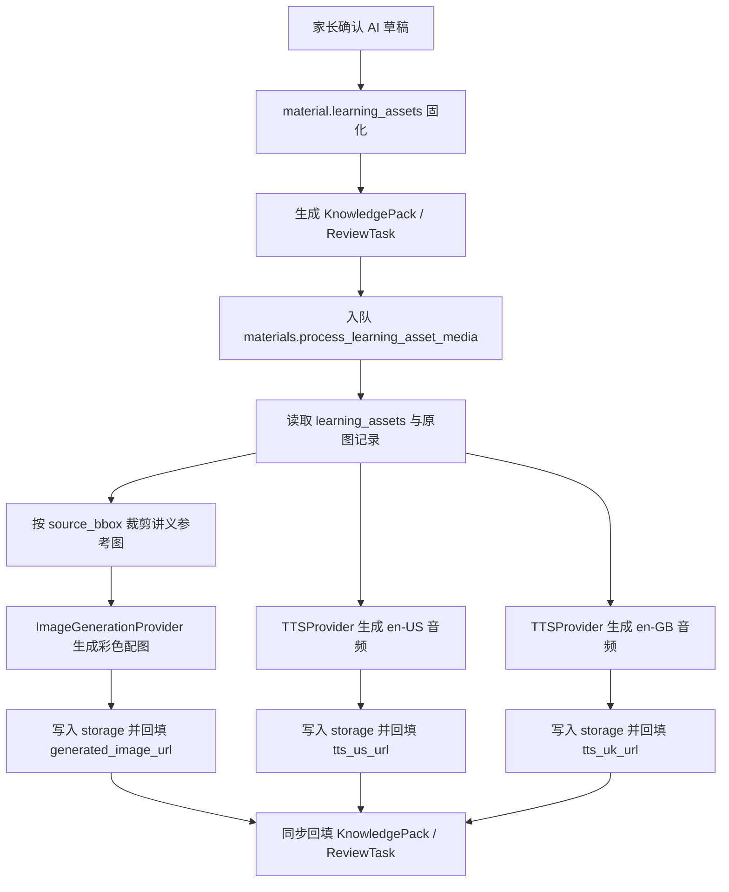

# HN-016：真实媒体生成 Provider 设计

## 背景

HN-014 已经把讲义识别结果升级为 `learning_assets`，并打通了课程详情中的彩色配图状态、英式 TTS 状态、美式 TTS 状态和主发音选择。当前实现仍使用 `HN014MockMediaProvider`，媒体文件来自仓库内固定的 Qq/Rr mock manifest，适合回归测试，但不能支撑真实讲义。

HN-016 的目标是把这条媒体链路换成真实外部 provider：家长确认讲义后，后台为每条核心学习资产生成彩色配图、英式发音音频和美式发音音频。mock provider 只保留给自动化测试、本地回归和显式兜底，不再作为正式运行路径。

## 目标

1. 课程确认后异步生成真实彩色配图、`en-US` TTS 和 `en-GB` TTS。
2. 配图要参考讲义内容，不做无关图库图；优先使用 `source_page_index` 和 `source_bbox` 对应的原讲义裁剪图作为视觉参考。
3. TTS 使用 `pronunciation_text`，为空时回退到 `text`，并分别生成美式和英式两份音频。
4. 生成结果统一写入现有 storage，再回填到 `CourseMaterial.learning_assets`、`KnowledgePack` 和 `ReviewTask`。
5. 图片、英式音频、美式音频独立失败，任何单项失败都不阻塞课程详情和复习入口。
6. Harness 新增 `HN-016`，能证明真实 provider 生成的图片和两种口音音频已被保存并能被移动端展示。

## 非目标

- 不实现孩子录音上传或 AI 语音评分；这属于 HN-017。
- 不重做 `learning_assets` 的 AI 抽取逻辑；HN-016 只消费已确认资产。
- 不做家长逐项编辑媒体 prompt、音色或图片风格。
- 不引入复杂媒体审核后台。
- 不做历史 mock 媒体批量迁移；旧数据按原 URL 继续可读。

## Provider 策略

新增真实媒体 provider 抽象，拆成两个独立接口：

- `ImageGenerationProvider`：根据学习资产、讲义裁剪图和 prompt 生成彩色配图。
- `TTSProvider`：根据文本、口音和语音配置生成音频。

第一版正式 provider 使用同一套配置框架承载真实外部服务。具体 provider adapter 通过配置选择，例如：

- `MEDIA_PROVIDER=real`
- `MEDIA_IMAGE_PROVIDER=openai`
- `MEDIA_TTS_PROVIDER=openai`

测试和本地回归使用：

- `APP_ENV=testing` 时强制 mock。
- 或显式设置 `MEDIA_PROVIDER=mock`。

如果正式运行环境选择 `real` 但缺少必要密钥或模型配置，worker 不回退成 mock，而是把对应媒体状态标为 `failed`，并写入中文失败说明。这样可以避免真实环境悄悄展示假媒体。

## 数据流

课程详情不等待媒体任务完成：

- 刚确认时：课程状态为 `ready`，媒体字段为 `processing` 或 `pending`。
- 图片或音频完成后：对应字段更新为 `ready`。
- 单项失败后：对应字段更新为 `failed`，其他媒体继续生成。

## 配图生成

每条学习资产构造一个图片生成请求：

- `text`：英文原文。
- `translation`：中文释义。
- `kind`：`word | phrase | sentence`。
- `source_visual_description`：讲义裁剪图中的主体、动作和语境。
- `image_prompt`：AI 抽取阶段给出的配图提示。
- `source_page_index` / `source_bbox`：定位原讲义区域。
- `reference_image_path`：从原图裁剪出的参考图，缺失时为空。

生成策略：

- 如果 provider 支持参考图输入，优先使用裁剪图做 image-to-image 或 reference-guided generation。
- 如果 provider 只支持文本 prompt，则把 `source_visual_description` 和 `image_prompt` 合并为强约束 prompt，并记录 `reference_mode=text_only`。
- 输出目标是适合儿童英语学习的彩色插图：主体清晰、背景简单、没有文字水印、不改变学习语义。
- 对句子类资产，图片应表达句子的核心动作或场景，例如 `A rabbit can hop fast.` 要体现兔子跳跃，而不是只画单独兔子。

输出文件写入 storage：

- 对象 key 形如 `generated/media/{material_id}/{asset_id}/image.png`。
- content type 使用 `image/png`。
- URL 通过现有 storage/public URL 规则返回。

## TTS 生成

每条学习资产生成两份音频：

- 美式：`accent=us`，语言标签 `en-US`。
- 英式：`accent=uk`，语言标签 `en-GB`。

文本规则：

- 优先使用 `pronunciation_text`。
- 为空时回退到 `text`。
- 不把中文释义、教学说明或标点说明读入音频。
- 单词、短语和句子都按自然英语发音处理。

输出文件写入 storage：

- 美式对象 key：`generated/media/{material_id}/{asset_id}/tts-us.mp3`
- 英式对象 key：`generated/media/{material_id}/{asset_id}/tts-uk.mp3`
- content type 使用 `audio/mpeg`。

主发音规则保持 HN-014 现状：

- `primary_accent=us` 时，复习任务优先使用 `tts_us_url`。
- `primary_accent=uk` 时，复习任务优先使用 `tts_uk_url`。
- 家长切换主发音时，继续同步回填 `KnowledgePack` 和 `ReviewTask` 的 `audio_url`。

## 合约变化

现有 `LearningAsset` 已包含核心媒体字段：

- `generated_image_status`
- `generated_image_url`
- `generated_image_object_key`
- `tts_us_status`
- `tts_us_url`
- `tts_us_object_key`
- `tts_uk_status`
- `tts_uk_url`
- `tts_uk_object_key`
- `primary_accent`

HN-016 增加只读诊断字段，方便 UI 和 Harness 判断失败原因：

- `generated_image_error`
- `tts_us_error`
- `tts_uk_error`

这些字段保存在现有 JSON 中，不需要新建关系表。`StoredAssetModel` 继续用于保存对象存储元数据；如果当前 storage 写入路径没有自动创建 `StoredAssetModel`，实施时需要补齐。

## 缓存与重试

缓存使用稳定 object key：

- 同一个 `material_id + asset_id + media_type + provider + model` 已有可读文件时，优先复用。
- 如果学习资产文本或 prompt 改变，后续可通过版本号扩展 key；HN-016 第一版不做家长编辑，因此先不引入版本字段。

重试策略：

- 单次 provider 调用使用独立超时。
- worker 对图片、US TTS、UK TTS 分别捕获异常。
- 本期不做自动多轮重试；失败后标 `failed`，后续可增加手动“重新生成媒体”入口。
- 已归档 material 的媒体任务必须立即跳过，不能重新写回可见状态。

## 配置

新增或扩展以下环境变量：

- `MEDIA_PROVIDER`：`real | mock`。
- `MEDIA_IMAGE_PROVIDER`：例如 `openai`。
- `MEDIA_TTS_PROVIDER`：例如 `openai`。
- `MEDIA_IMAGE_MODEL`：图片生成模型名。
- `MEDIA_TTS_MODEL`：TTS 模型名。
- `MEDIA_TTS_US_VOICE`：美式发音 voice。
- `MEDIA_TTS_UK_VOICE`：英式发音 voice。
- `MEDIA_REQUEST_TIMEOUT_SECONDS`：媒体 provider 单次请求超时。
- `MEDIA_HTTP_TRUST_ENV`：是否继承系统代理，默认与 AI provider 一样保守处理。

实际实施前需要以 provider 官方文档校验 endpoint、模型名、音频格式和图片输入能力，并把最终命令与配置写入 `infra/env/local.example.env` 和 Harness 文档。

## 移动端行为

AI 校对页继续展示文字资产和讲义裁剪图，不等待真实媒体。

课程详情页：

- `processing`：显示生成中状态。
- `ready`：显示真实彩色配图和 US/UK TTS 状态。
- `failed`：显示简短中文失败状态，不展示 provider 原始英文错误。
- 主发音切换继续可用；如果目标口音音频失败，则切换按钮置灰或提示该口音暂不可用。

移动端不直接调用媒体 provider，只消费 API 返回的 URL 和状态。

## 测试计划

API / worker 测试：

- provider contract：mock 一个真实 provider 返回图片 bytes 和音频 bytes，断言 worker 写入 storage 并回填 URL。
- 图片失败不影响 US/UK TTS 成功。
- US TTS 失败不影响图片和 UK TTS 成功。
- `MEDIA_PROVIDER=real` 且缺少配置时，媒体状态为 `failed`，不静默回退 mock。
- `APP_ENV=testing` 时仍可使用 mock provider 保障自动化稳定。
- 已归档 material 的媒体任务跳过。
- 主发音切换后，`KnowledgePack` 和 `ReviewTask` 使用对应口音音频 URL。

Flutter 测试：

- 课程详情展示真实媒体 ready 状态。
- 课程详情展示图片生成中、音频生成中、失败状态。
- 主发音切换对不可用口音有中文提示。
- 现有 HN-014 mock URL 仍能被 `RemoteAssetImage` 正常渲染，防止回归。

Harness 验收：

- 新增 `HN-016` 到 `docs/harness/upload-recognition-loop.md`。
- 更新 `docs/harness/mvp-readiness-checklist.md`，把真实媒体 provider 作为 P1 验收项。
- 保存证据到 `dist/harness/HN-016/`：
  - media job 日志。
  - material JSON 摘录，包含 `generated_image_url`、`tts_us_url`、`tts_uk_url`。
  - storage 对象清单或本地文件路径。
  - 课程详情截图。

## 风险与处理

- 外部 provider 网络不稳定：媒体任务失败不阻塞课程，状态可见。
- 图片 provider 不支持参考图：降级为 text-only prompt，但保留诊断。
- 成本不可控：HN-016 只处理家长确认后的 1 到 20 个核心资产，不在 AI 草稿阶段生成真实媒体。
- 音色不符合家长期望：第一版只区分 US/UK，后续再做音色选择。
- 真实图片生成慢：课程详情先可用，轮询或刷新后展示完成状态。
- 本地开发缺少密钥：测试使用 mock；正式 real 模式缺配置时失败可见。

## 完成标准

HN-016 完成时应满足：

- 真实 provider 能为至少一份 Qq/Rr 测试讲义生成彩色配图、US TTS 和 UK TTS。
- 生成文件被写入 storage，而不是直接引用 provider 临时 URL。
- `material.learning_assets`、`KnowledgePack`、`ReviewTask` 均回填可用媒体 URL。
- mock provider 仍只服务测试和显式本地回归。
- API、worker、Flutter 自动化测试通过。
- `dist/harness/HN-016/` 有可复查证据。
