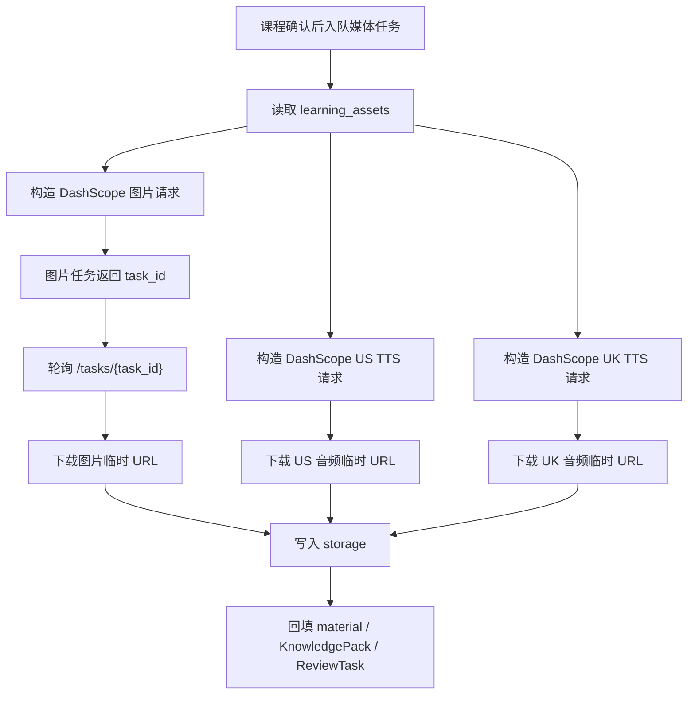

# HN-016A：DashScope 国内媒体 Provider 设计

## 背景

HN-016 已经把学习资产媒体生成抽象为可配置 provider：本地默认 `mock`，正式模式可通过 `MEDIA_PROVIDER=real` 使用 OpenAI image / TTS provider。下一步需要增加国内模型支持，降低国内网络、计费、合规和可用性风险。

HN-016A 只扩展媒体 provider，不改变 `CourseMaterial -> MaterialParseJob -> KnowledgePack -> ReviewTask` 主链，也不改变移动端直接消费 URL 和状态的方式。

## 目标

1. 在保留 OpenAI provider 的基础上，新增 DashScope / 百炼媒体 provider。
2. 支持 `MEDIA_IMAGE_PROVIDER=dashscope` 生成彩色配图。
3. 支持 `MEDIA_TTS_PROVIDER=dashscope` 生成 US / UK 两份英文发音音频。
4. DashScope 返回的临时结果必须立即下载并转存到现有 storage，不能长期引用 provider 临时 URL。
5. 图片、US TTS、UK TTS 继续独立失败，失败原因写入合同但对家长展示固定中文提示。
6. Harness 增加 `HN-016A` 证据目录，能证明 DashScope provider 的任务、结果下载、storage 回填和课程详情展示。

## 非目标

- 不删除 OpenAI provider。
- 不重做 HN-016 worker、storage、移动端状态机。
- 不实现孩子录音上传或 AI 发音评分；那仍属于 HN-017。
- 不在 AI 校对草稿阶段生成真实媒体；仍然只在家长确认课程后异步生成。
- 不做多 provider 自动降级。显式配置 DashScope 失败时应失败可见，不自动切回 OpenAI 或 mock。

## Provider 选择

第一批国内 provider 采用阿里云 DashScope / 百炼：

- 图片：万相图像生成 / 图像编辑。
- TTS：CosyVoice 语音合成。

选择原因：

- 图片和 TTS 都在同一套 `DASHSCOPE_API_KEY` 下，可减少配置复杂度。
- 图像生成是异步任务，天然适合当前 worker 后台处理。
- CosyVoice HTTP 非流式接口可直接返回音频临时 URL，适合下载后转存。

## 配置

新增或扩展以下环境变量：

```dotenv
# DashScope / Model Studio media provider.
DASHSCOPE_API_KEY=
DASHSCOPE_BASE_URL=https://dashscope.aliyuncs.com/api/v1
MEDIA_IMAGE_PROVIDER=dashscope
MEDIA_IMAGE_MODEL=wan2.6-image
MEDIA_IMAGE_EDIT_MODEL=wanx2.1-imageedit
MEDIA_TTS_PROVIDER=dashscope
MEDIA_TTS_MODEL=cosyvoice-v3-flash
MEDIA_TTS_US_VOICE=
MEDIA_TTS_UK_VOICE=
MEDIA_PROVIDER_POLL_INTERVAL_SECONDS=10
MEDIA_PROVIDER_MAX_POLL_SECONDS=180
```

兼容 OpenAI 的配置方式保持不变：

```dotenv
MEDIA_PROVIDER=real
MEDIA_IMAGE_PROVIDER=openai
MEDIA_TTS_PROVIDER=openai
```

DashScope 运行时示例：

```dotenv
MEDIA_PROVIDER=real
MEDIA_IMAGE_PROVIDER=dashscope
MEDIA_TTS_PROVIDER=dashscope
```

`MEDIA_PROVIDER=mock` 继续用于本地回归和自动化测试。

## 图片生成

### 无参考图

当学习资产没有可用的讲义裁剪图时，DashScope image provider 使用万相文生图接口：

1. `POST /services/aigc/image-generation/generation`
2. Header 包含 `X-DashScope-Async: enable`。
3. 请求体包含 `model=wan2.6-image`、`input.messages[].content[].text` 和必要参数。
4. 返回 `task_id` 后轮询 `GET /tasks/{task_id}`。
5. 任务成功后读取结果图片 URL，立即下载 bytes。
6. worker 通过现有 storage 写入 `generated/media/{material_id}/{asset_id}/image.png`。

### 有参考图

当学习资产有 `source_page_index` 和 `source_bbox`，且本地能裁剪讲义图片时，DashScope image provider 优先使用万相图像编辑：

1. 将裁剪图转为 `data:image/png;base64,...`。
2. 默认仍使用 `POST /services/aigc/image-generation/generation`，在 `input.messages[].content[]` 中同时传入 `text` 和 `image`。
3. 如果需要万相 2.1 的特定图像编辑能力，再使用 `POST /services/aigc/image2image/image-synthesis` 和 `MEDIA_IMAGE_EDIT_MODEL=wanx2.1-imageedit`。
4. 2.1 编辑模式下，`input.function` 优先使用 `colorization` 或 `description_edit`，`input.base_image_url` 使用 data URL。
5. 同样通过 `task_id` 轮询、下载结果并转存 storage。

第一版推荐默认策略：

- 如果讲义裁剪图是黑白/灰度学习页，使用 `colorization`。
- 如果裁剪图主体不完整或需要重绘成儿童插图，使用 `description_edit`。
- 如果 provider 报错或不支持该函数，图片通道标记 `failed`，不影响 US/UK TTS。

## TTS 生成

DashScope TTS provider 使用 CosyVoice HTTP 非流式接口：

1. `POST /services/audio/tts/SpeechSynthesizer`
2. 请求体包含 `model`、`input.text`、`input.voice`、`input.format=mp3`。
3. `input.text` 继续使用 `pronunciation_text`，为空时回退到 `text`。
4. `language_hints` 使用 `["en"]`，避免英文词句被中文方式朗读。
5. 返回 `output.audio.url` 后立即下载 bytes。
6. worker 写入：
   - `generated/media/{material_id}/{asset_id}/tts-us.mp3`
   - `generated/media/{material_id}/{asset_id}/tts-uk.mp3`

US / UK 的差异由 `MEDIA_TTS_US_VOICE` 和 `MEDIA_TTS_UK_VOICE` 控制。第一版不在代码中强判口音真实性，因为 CosyVoice 的音色是否严格区分英美口音取决于具体账号可用音色。Harness 需要记录实际使用的 voice，并把“英美口音为 provider voice best-effort”写入证据说明。

## 错误处理

DashScope provider 的错误处理遵循 HN-016 现有规则：

- 缺少 `DASHSCOPE_API_KEY`：worker 将对应未 ready 媒体标记为 `failed`。
- 创建任务失败：该媒体通道 `failed`。
- 轮询超时：该媒体通道 `failed`。
- 任务返回 `FAILED`：该媒体通道 `failed`。
- 结果 URL 下载失败：该媒体通道 `failed`。
- provider 原始错误不直接展示给家长；移动端只看到固定中文失败说明。
- 已经 `ready` 的媒体在重试或配置失败时不应被覆盖。

服务端可记录 provider 原始错误用于排查，但不得把 API key、临时 URL 签名或原始 env 值写入家长可见字段。

## 数据流



## 代码边界

预计新增或修改：

- `services/api/app/core/settings.py`
  - 增加 DashScope base URL、image edit model、polling 配置。
- `services/api/app/services/learning_asset_media.py`
  - 增加 `DashScopeImageGenerationProvider`。
  - 增加 `DashScopeTTSProvider`。
  - `build_media_provider_bundle()` 支持 `dashscope`。
- `infra/env/local.example.env`
  - 增加 DashScope 媒体 provider 示例。
- `docs/harness/upload-recognition-loop.md`
  - 增加 HN-016A。
- `docs/harness/mvp-readiness-checklist.md`
  - 增加 HN-016A 证据路径或作为 HN-016 readiness 子项。

不应修改：

- 移动端 API 调用路径。
- `LearningAsset` 合同字段。
- worker 的主状态流，除非是为了注入 DashScope provider 必要的通用 helper。

## 测试计划

API / provider 测试：

- DashScope image 文生图：mock 创建任务、轮询成功、下载图片 bytes。
- DashScope image 图像编辑：断言 data URL 被传入 `base_image_url`。
- DashScope image 任务失败：抛 `MediaProviderError`。
- DashScope image 轮询超时：抛 `MediaProviderError`。
- DashScope TTS：mock 返回 `output.audio.url`，下载 mp3 bytes。
- DashScope TTS 缺少 audio URL：抛 `MediaProviderError`。
- `MEDIA_IMAGE_PROVIDER=dashscope` 缺 `DASHSCOPE_API_KEY`：抛配置错误。
- `MEDIA_TTS_PROVIDER=dashscope` 缺 `DASHSCOPE_API_KEY`：抛配置错误。

Worker 测试：

- DashScope provider 返回图片和两份音频后，storage 写入 3 个 generated media 对象。
- DashScope 图片失败不影响 US/UK TTS。
- DashScope 配置失败不覆盖已有 ready media。
- provider 原始错误不进入家长可见错误字段。

Flutter 测试：

- 不需要新增 provider 专属 UI 测试。
- 复用 HN-016 的媒体 ready / failed / legacy URL 测试。

Harness 验收：

- 新增 `dist/harness/HN-016A/`。
- 保存：
  - DashScope provider 配置摘要，不含 key。
  - worker log 摘要。
  - material JSON 摘录。
  - generated media storage 文件清单。
  - 课程详情截图。
  - provider 限制说明，尤其是 US / UK voice 的 best-effort 口音说明。

## 完成标准

HN-016A 完成时应满足：

- `MEDIA_IMAGE_PROVIDER=dashscope` 能生成或编辑一张学习资产配图并转存 storage。
- `MEDIA_TTS_PROVIDER=dashscope` 能生成 US / UK 两份音频并转存 storage。
- OpenAI provider 现有测试保持通过。
- mock provider 仍服务测试和本地回归。
- API、worker、Flutter 自动化测试通过。
- `dist/harness/HN-016A/` 有可复查证据。

## 官方文档依据

- DashScope CosyVoice TTS：`POST /api/v1/services/audio/tts/SpeechSynthesizer`，非流式返回 `output.audio.url`。
- DashScope 万相图像生成：异步创建任务，保存 `task_id` 后通过 `GET /api/v1/tasks/{task_id}` 轮询结果。
- DashScope 万相图像编辑：`POST /api/v1/services/aigc/image2image/image-synthesis`，支持 `base_image_url` 使用 URL 或 data URL。
