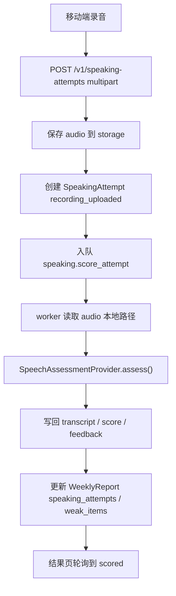

# HN-017：孩子录音上传与 AI 语音评分设计

## 背景

当前 LearningEnglish 已经完成“上传讲义 -> AI 校对 -> 课程详情 -> 复习任务 -> 周报”的主链，课程详情里也能展示学习资产、配图和英美音 TTS。移动端已经存在 `SpeakingPartnerScreen`，后端也已经存在 `SpeakingAttemptModel` 和 `/v1/speaking-attempts`，但当前实现仍是 stub：移动端点击按钮后直接提交固定 transcript，后端返回固定分数和固定反馈。

HN-017 要把 speaking 从“有入口”推进到“可练、可评、可汇总”的闭环。孩子需要能真正录音，系统需要保存音频、异步转写和评分，家长需要看到结果页，周报需要累计口语练习表现。

## 目标

1. 移动端支持孩子对讲义中的核心词或句子录音。
2. 后端长期保存录音文件，形成可追溯的 `SpeakingAttempt`。
3. 评分链路异步执行，不让页面请求等待 AI provider。
4. 评分结果至少包含转写文本、总分、发音分、准确度、完整度、流利度、逐词反馈和中文建议。
5. 口语结果页能展示处理中、评分成功、失败可重试三类状态。
6. speaking 结果进入 `ReviewTask`、`PracticeSession` 和 `WeeklyReport` 的汇总口径。
7. Harness 新增 `HN-017`，保存 API、worker、移动端和真机证据。

## 非目标

- 不做自由对话陪练。
- 不做实时流式评分。
- 不做孩子端账号体系。
- 不做音频波形编辑、裁剪、降噪和回放列表。
- 不要求第一版输出音素级图谱；如果 provider 返回音素信息，先保存到 `raw_result` 或逐词明细里，移动端只展示逐词级别。
- 不改变 HN-014 / HN-016 的学习资产和媒体生成主链。

## 当前代码事实

- 后端已有 `SpeakingAttemptStatus`：`queued`、`recording_uploaded`、`transcribing`、`scored`、`failed`。
- 后端已有 `SpeakingAttemptModel`，字段包括 `prompt_text`、`audio_url`、`transcript`、`pronunciation_score`、`feedback`、`status`。
- 后端已有 `GET/POST /v1/speaking-attempts`，但 `POST` 当前只接 JSON 并返回固定反馈。
- 移动端 `SpeakingPartnerScreen` 当前只有“提交回答”按钮，没有真实录音。
- 移动端 repository 当前用 JSON 调用 `POST /speaking-attempts`。
- worker 当前注册了 `materials.process_material_job` 和 `materials.process_learning_asset_media`，还没有 speaking 任务。
- `ReviewTask` 已有 `speaking_prompt` 类型，但当前复习 runner 只是展示文本，然后在完成复习后跳转 speaking 页面。

## 方案选择

### 方案 A：异步录音评分闭环

录音上传后立即创建 attempt 并入队，移动端结果页轮询 attempt 状态。worker 负责读取音频、调用 speech assessment provider、写回评分结果。

优点：
- 与现有 AI 校对和媒体生成的后台任务模式一致。
- 避免页面等待 provider 导致超时。
- 可以自然支持失败重试和 provider 切换。

缺点：
- 需要新增 worker 任务、队列函数和更多状态测试。

### 方案 B：同步上传并等待评分

移动端上传音频后，API 直接调用 provider 并返回结果。

优点：
- 代码路径短。

缺点：
- 容易复现之前 AI 校对页 30 秒超时问题。
- 真机体验不可控，不适合作为正式主链。

### 方案 C：只做录音存储

第一版只保存音频，不做转写和评分。

优点：
- 风险最低。

缺点：
- speaking 仍然不能闭环，无法满足 HN-017 的核心目标。

### 决策

采用方案 A。第一版必须包含 stub provider，保证本地和 CI 可稳定回归；同时保留真实 provider 配置边界。真实 provider 优先对齐阿里云语音评测能力，因为官方文档覆盖儿童英文单词和儿童英文句子跟读，并返回总分、流利度、准确度、完整度和逐词反馈等维度。

参考资料：
- 阿里云语音评测题型介绍：https://help.aliyun.com/zh/document_detail/2996297.html
- 阿里云儿童单词语音评测：https://help.aliyun.com/zh/document_detail/2996310.html
- 阿里云儿童英文句子语音评测：https://help.aliyun.com/zh/document_detail/2996318.html
- Flutter `record` 插件：https://pub.dev/packages/record

## 产品流程

1. 家长进入复习完成页或 speaking prompt 任务。
2. App 根据学习资产选择一个目标文本：
   - 如果 review task 有 `asset_id`，优先读取对应学习资产的 `pronunciation_text` 或 `text`。
   - 如果没有学习资产，回退到 `content_json.prompt` 或 `prompt_text`。
3. 孩子点击录音按钮并朗读目标词或句子。
4. App 停止录音后显示本地草稿状态，可重录或提交。
5. 提交后 App 通过 multipart 上传音频。
6. API 保存音频到 storage，创建 `SpeakingAttempt(status=recording_uploaded)`，入队 `speaking.score_attempt`。
7. 结果页轮询 `GET /speaking-attempts/{attempt_id}`。
8. worker 评分成功后写回 `status=scored`、转写、分数和反馈。
9. 结果页展示中文反馈、逐词表现和下一步建议。
10. 周报累计 `speaking_attempts`，并把低分词句写入 `weak_items`。

## 后端合同

### `SpeakingAttempt`

扩展后的 API 合同保留旧字段，并新增结果页需要的字段：

```json
{
  "id": "attempt_xxx",
  "child_id": "child_xxx",
  "material_id": "material_xxx",
  "review_task_id": "task_xxx",
  "learning_asset_id": "asset_xxx",
  "prompt_text": "跟读：A rabbit can hop fast.",
  "target_text": "A rabbit can hop fast.",
  "audio_url": "http://localhost:8000/uploads/speaking_attempt/attempt_xxx/input.m4a",
  "audio_object_key": "speaking_attempt/attempt_xxx/input.m4a",
  "audio_content_type": "audio/mp4",
  "audio_size_bytes": 12345,
  "audio_duration_ms": 4200,
  "transcript": "A rabbit can hop fast.",
  "overall_score": 88,
  "pronunciation_score": 0.86,
  "accuracy_score": 91,
  "fluency_score": 82,
  "completeness_score": 95,
  "feedback": "整体读得很清楚，hop 的开头可以再轻一点。",
  "word_feedback": [
    {
      "word": "rabbit",
      "score": 92,
      "status": "good",
      "tip": "读得清楚。"
    },
    {
      "word": "hop",
      "score": 74,
      "status": "needs_practice",
      "tip": "注意 h 的轻出气。"
    }
  ],
  "suggestions": ["再跟读一次 hop。"],
  "provider": "stub",
  "raw_result": {},
  "failure_reason": "",
  "status": "scored",
  "created_at": "2026-05-25T10:00:00Z",
  "updated_at": "2026-05-25T10:00:10Z"
}
```

字段口径：
- `pronunciation_score` 保持现有 0 到 1 浮点值，兼容旧移动端展示。
- `overall_score`、`accuracy_score`、`fluency_score`、`completeness_score` 使用 0 到 100。
- `word_feedback.status` 只使用 `good`、`ok`、`needs_practice`。
- `raw_result` 只给内部排查使用，不在移动端默认展示。

### API

- `GET /v1/speaking-attempts?child_id=&material_id=`
  - 保留现有列表能力，过滤 archived material。
- `GET /v1/speaking-attempts/{attempt_id}`
  - 返回单次 attempt，用于结果页轮询。
- `POST /v1/speaking-attempts`
  - 改为 multipart。
  - 表单字段：`child_id`、`material_id`、`prompt_text`、`target_text`、`review_task_id`、`learning_asset_id`、`audio_duration_ms`。
  - 文件字段：`audio`。
  - 创建成功返回 `201` 和 attempt。
- `POST /v1/speaking-attempts/{attempt_id}/retry`
  - 将失败或已评分 attempt 重新置为 `recording_uploaded` / `transcribing` 并再次入队。

### 音频限制

第一版限制：
- content type 允许 `audio/m4a`、`audio/mp4`、`audio/aac`、`audio/wav`、`audio/mpeg`、`application/octet-stream`。
- 最大文件大小 10 MB。
- 移动端录音最长 30 秒。
- 后端不信任客户端 duration，只把 `audio_duration_ms` 当辅助展示字段。

## 后端处理链路



失败规则：
- 上传校验失败直接返回 `400`，不创建 attempt。
- 入队失败时 attempt 保持 `recording_uploaded`，返回中文警告，允许 retry。
- worker provider 失败时写 `status=failed` 和中文 `failure_reason`。
- archived material 的 attempt 不可创建、不可 retry；已有 attempt 可在列表中隐藏。
- retry 不覆盖原始录音文件，只复用已保存音频重新评分。

## Provider 设计

新增 `SpeechAssessmentProvider`：

```python
class SpeechAssessmentProvider(Protocol):
    def assess(
        self,
        *,
        audio_path: Path,
        target_text: str,
        prompt_text: str,
        attempt_id: str,
        accent: str,
    ) -> SpeechAssessmentResult:
        ...
```

`SpeechAssessmentResult` 包含：
- `transcript`
- `overall_score`
- `pronunciation_score`
- `accuracy_score`
- `fluency_score`
- `completeness_score`
- `feedback`
- `word_feedback`
- `suggestions`
- `provider`
- `raw_result`

Provider 模式：
- `SPEECH_PROVIDER=stub`：本地默认，确定性返回结果，保证 API/worker/mobile 测试可跑。
- `SPEECH_PROVIDER=aliyun`：真实语音评测 provider，使用阿里云智能科教内容生成语音评测能力。

Aliyun provider 配置：

```dotenv
SPEECH_PROVIDER=stub
SPEECH_ASSESSMENT_PROVIDER=aliyun
SPEECH_ASSESSMENT_BASE_URL=
SPEECH_ASSESSMENT_APP_KEY=
SPEECH_ASSESSMENT_SECRET_KEY=
SPEECH_ASSESSMENT_TIMEOUT_SECONDS=120
SPEECH_ASSESSMENT_HTTP_TRUST_ENV=false
SPEECH_ASSESSMENT_DEFAULT_ACCENT=am
```

说明：
- `am` 表示美式，`en` 表示英式，和阿里云语音评测文档中的 accent 约定一致。
- 真实 provider 的签名、上传和音频格式转换按官方接入文档实现；不能把 app key、secret、签名、临时音频 URL 写入家长可见字段。
- 如果真实 provider 未配置，worker 写入中文失败原因，不回退 stub。

## 移动端设计

### 页面结构

`SpeakingPartnerScreen` 拆成三个状态区：
- 目标区：展示目标词/句、中文释义、来源学习资产图或课程插图。
- 录音区：录音按钮、计时、重录、提交。
- 结果区：处理中、评分结果、失败重试。

第一版使用 `record: ^6.2.1` 录音：
- iOS 使用 `AVFoundation`。
- Android 使用平台原生录音能力。
- 录音文件保存到临时目录。

### UI 状态

- `idle`：显示目标文本和“开始录音”。
- `recording`：显示计时和“停止”。
- `recorded`：显示“重新录音”和“提交评分”。
- `uploading`：按钮禁用，显示上传中。
- `processing`：进入结果轮询。
- `scored`：展示总分、维度分、逐词反馈和建议。
- `failed`：显示中文失败原因和“重新评分”。

### 权限

- iOS 需要 `NSMicrophoneUsageDescription`。
- Android 需要 `RECORD_AUDIO`。
- 权限被拒绝时显示中文说明，不进入录音状态。

## 数据关联

- `SpeakingAttempt.review_task_id` 用于把某次 speaking 和复习任务关联。
- `SpeakingAttempt.learning_asset_id` 用于把评分结果和具体词卡/句子关联。
- `ReviewTask.content_json` 的 speaking prompt 应包含 `asset_id`、`target_text`、`translation` 和可选 `image_url`。
- `WeeklyReport.speaking_attempts` 在评分成功时累计，不在上传时累计。
- 低于 80 分的词句写入 `WeeklyReport.weak_items`，用于 HN-018 报告深化。

## 测试与 Harness

自动化：
- API：上传音频创建 attempt、权限校验、archived material 拒绝、retry 入队、列表和详情过滤。
- Worker：stub provider 成功写回、provider 失败写 `failed`、archived material 跳过、周报累计。
- Contract：Dart/Python 合同字段解析。
- Flutter：录音状态机、上传后轮询、成功结果页、失败重试、权限拒绝。

人工 / 真机：
- iPhone 真机录音并提交。
- API 日志出现 `POST /v1/speaking-attempts`。
- worker 日志出现 `speaking.score_attempt`。
- 保存 attempt JSON、storage 音频对象、结果页截图。

证据目录：
- `dist/harness/HN-017/speaking-attempt-upload.json`
- `dist/harness/HN-017/speaking-attempt-scored.json`
- `dist/harness/HN-017/speaking-worker.log`
- `dist/harness/HN-017/speaking-result-screen.png`
- `dist/harness/HN-017/real-device-speaking-summary.json`

## 验收标准

- 录音上传后，后端保存一条 `StoredAssetModel(owner_type="speaking_attempt")`。
- `SpeakingAttempt.audio_url` 指向 storage URL，不是本地临时路径。
- 上传接口返回 `recording_uploaded` 或 `transcribing`，不会等待 provider 完成。
- worker 成功后 attempt 进入 `scored`，并包含 transcript、总分、维度分、逐词反馈和中文建议。
- worker 失败后 attempt 进入 `failed`，移动端能重试。
- speaking 结果页不会展示英文堆栈、provider 原始错误或密钥相关信息。
- `WeeklyReport.speaking_attempts` 只在评分成功后增加。
- archived material 不能创建或 retry speaking attempt。
- 真机可以录音、上传、看到结果页。

## 风险与取舍

- 真实语音评测 provider 的接入复杂度高于 TTS；第一版必须先把 stub 链路和异步状态机做稳，真实 provider 可以在同一分支后半段接入。
- 录音格式在 iOS / Android 上可能不同；后端第一版只做 content type 和大小校验，必要时由 provider adapter 做格式转换。
- provider 返回的分数字段不完全统一；后端用统一 `SpeechAssessmentResult` 做归一化，移动端只依赖统一合同。
- 周报当前仍是轻量聚合；HN-017 只写入 speaking 次数和弱项，详细趋势留给 HN-018。
